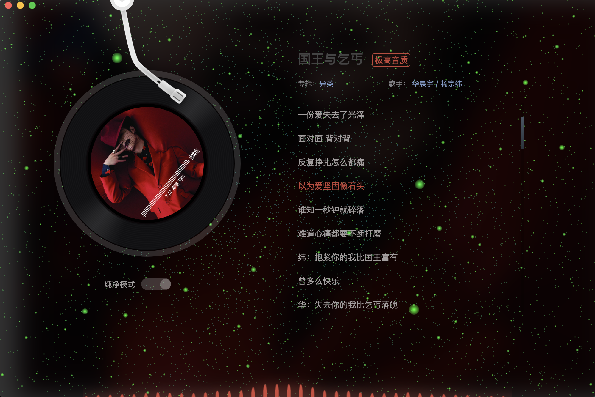

# rustle-music

  
  

  
  

# start
1. `yarn` (add dependencies package, node version is v10)
2. `yarn start` (start http-dev-server)
3. `yarn dev --dev` (start electron client)
4. Enjoy music

## 用到了一些个人写的库
+ [grass](https://github.com/imtaotao/Grass) 
  用于搭建本项目视图层，使用 `template` + `virtual-dom` 进行 ui 的渲染
+ [hearken](https://github.com/imtaotao/hearken) 
  深度封装了 `webaudio` 简化开发难度，本项目所有音频管理都是使用 `hearken`
+ [input-range](https://github.com/imtaotao/input-range) 
  一个可以高度自定义 ui 样式的滑动条工具库，本项目所有滑动条都依赖此库

## 下载
windows 下体验不是很好，有点小卡。请使用 mac 版本，如果想体验最新版本，可以 clone 本仓库代码，然后运行起来。安装包[下载地址](https://imtaotao.github.io/rustle-music)

## 注意事项
开了 `vpn` 可能导致无法从服务器获取音频资源，从而无法播放

## 问题
1. web 层与 node 层的依赖在同一个 node_modules 里面导致有重复的代码，因为 web 层的代码会打包成静态文件，从而使得 node_modules 冗余，但我比较懒，不想分开成两个项目，先就这样吧
2. 现在过了几年，开发的环境有些变化